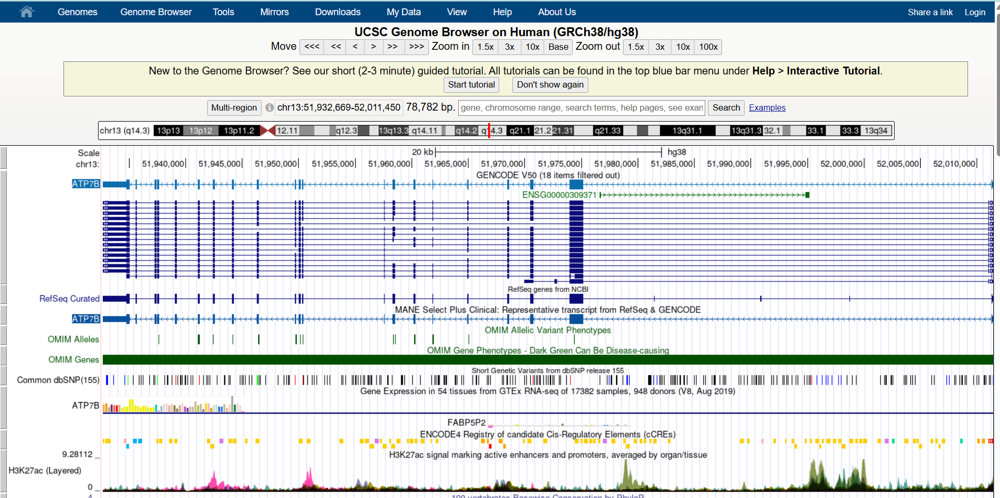
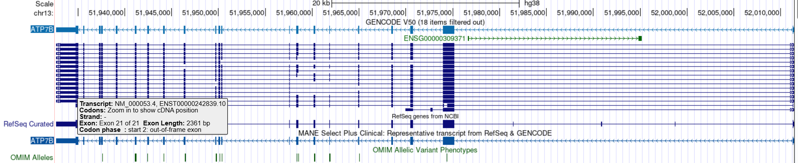
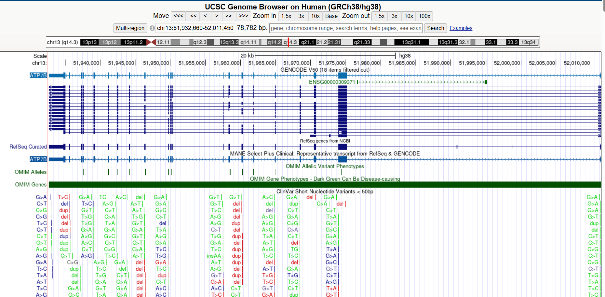
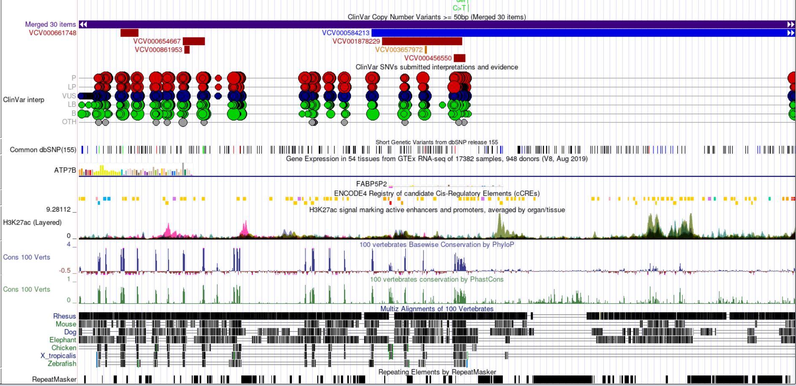
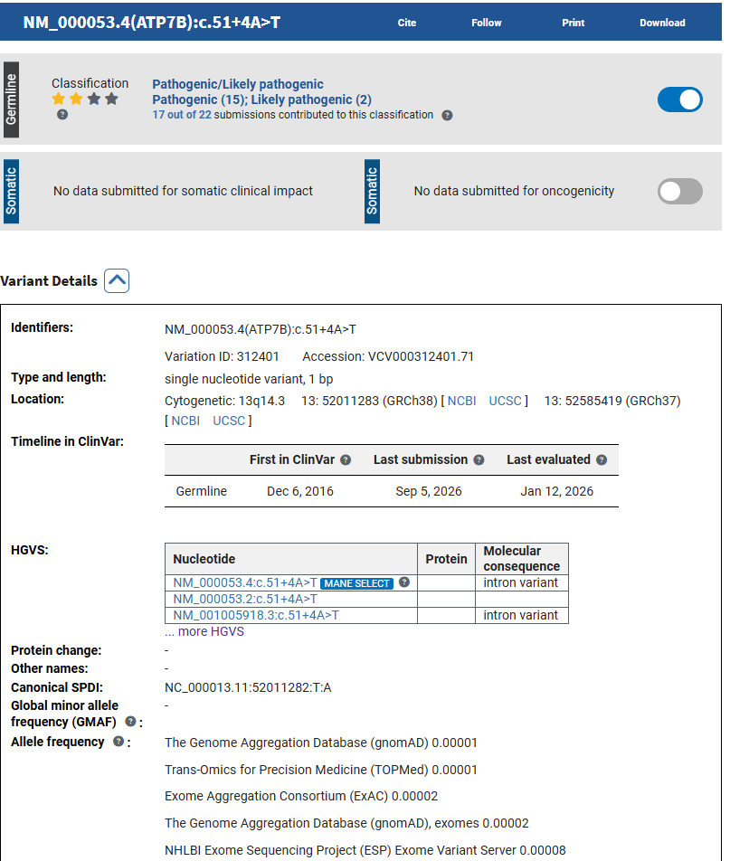
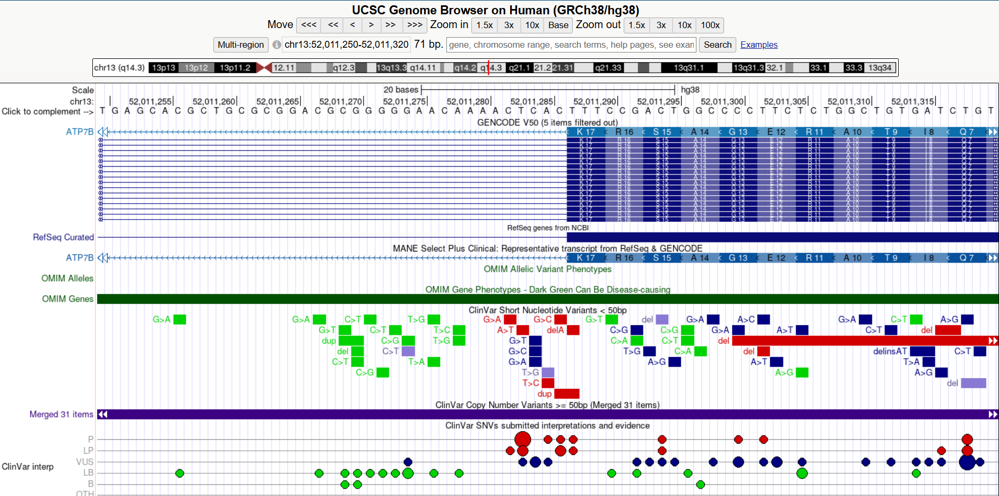

# Exploring a Human Disease Gene Using UCSC Genome Browser and NCBI ClinVar

Name: Junavhel Jane B. Olaguir

Assigned Gene: ATP7B

Associated Disease: Wilson disease

Activity: Exploring a Human Disease Gene Using UCSC Genome Browser and NCBI ClinVar

# Bioinformatics Lab Activity

This activity explores the ATP7B gene associated with Wilson disease using the UCSC Genome Browser and NCBI ClinVar to examine its genomic location, structure, and clinically reported variants.

# 2. UCSC Gene Location

Official gene symbol: ATP7B

Full gene name: ATPase copper transporting beta

Chromosome: 13

Genome assembly: GRCh38/hg38

Genomic coordinates: chr13:51,932,669–52,011,450

DNA strand: Negative (−)

Approximate gene size: 78,782 bp (~78.8 kb)

# Screenshot 1 – ATP7B Gene Location

# 3. Exons, Introns, and Transcripts

Selected transcript: MANE Select Plus Clinical (NM_000053.4 / ENST00000242839.10)

**Number of exons:** 21

**Multiple transcripts/isoforms visible:** Yes

**Exon:** Exons are gene regions retained in the mature RNA after splicing, while introns are intervening regions removed during RNA processing.

**Exon-intron structure:** The introns generally appear much longer than the exons, with relatively small exon blocks separated by long connecting regions.

### Screenshot 2 – ATP7B Gene Structure

# 4. UCSC Annotation Tracks

**a. Gene annotation track:**  
I used the GENCODE V50 and RefSeq Curated gene annotation tracks to examine the ATP7B gene structure.

**b. ClinVar variants:**  
Yes. Numerous ClinVar-related variant marks were visible within the ATP7B genomic region.

**c. Conservation:**  
Yes. Some regions showed stronger conservation signals than others.

**d. Conserved regions:**  
The stronger conservation signals generally correspond with exon regions, although some conserved regions are also present in non-exonic/intronic regions.

**e. Biological importance of conservation:**  
Strong conservation suggests that a genomic region has been maintained across species because it may perform an important biological function. Changes in highly conserved regions may therefore be more likely to affect gene function.

### Screenshot 3 – UCSC Annotation and Conservation Tracks

# 5. Selected ClinVar Variant Record

Gene: ATP7B

Variant/HGVS:
NM_000053.4(ATP7B):c.51+4A>T

Variation ID:
312401

VCV accession:
VCV000312401.71

Chromosome:
chr13

GRCh38 position:
52,011,283

Associated condition:
Wilson disease

Clinical significance:
Pathogenic/Likely pathogenic

Review status:
2 stars

Molecular consequence:
Intron variant

Variation/condition record:
RCV000324263.41

# Screenshot 4 – Selected ClinVar Variant

# 6. Locating the Variant in UCSC

**Selected variant:** NM_000053.4(ATP7B):c.51+4A>T

**Genomic position:** chr13:52,011,283 (GRCh38)

**a. Variant location:**  
The selected variant is located within the ATP7B gene region on chromosome 13 at GRCh38 position 52,011,283.

**b. Genomic region:**  
The variant is an intronic variant located near an exon–intron boundary and is classified by ClinVar as a splice-region variant.

**c. Coding or non-coding:**  
The variant is located in a non-coding intronic region, although its position near the splice boundary may affect RNA processing.

**d. Possible effect:**  
The variant may affect ATP7B pre-mRNA splicing because it is located within an intron near an exon–intron boundary. Altered splicing could affect the production or structure of the ATP7B protein.

**e. Additional evidence:**  
Additional evidence such as RNA or functional splicing studies, clinical data, segregation analysis, population-frequency data, and other genetic evidence would help determine the variant's actual effect on ATP7B and its relationship to Wilson disease.

### Screenshot 5 – Selected Variant in UCSC

# 7. Interpretation:

The selected ATP7B variant c.51+4A>T is located in an intronic region near an exon–intron boundary. Its position may allow it to affect RNA splicing and potentially alter ATP7B function, but additional functional and clinical evidence is needed to determine its actual disease-related effect.

# 8. Reflection

### 1. What did UCSC show you about your gene that was not obvious from simply reading about the gene's function?

The UCSC Genome Browser showed the detailed genomic organization of the ATP7B gene, including its exon-intron structure, multiple transcripts, and conserved regions. It also showed that many clinically reported variants are located throughout the ATP7B genomic region.

### 2. Why is knowing the exact genomic location of a disease-associated variant useful?

Knowing the exact genomic location allows the variant to be precisely connected to the ATP7B gene and its annotated genomic features. It also helps determine whether the variant is located in an exon, intron, UTR, splice region, or another functional region.

### 3. What is one limitation of predicting a variant's effect only from its genomic location?

Genomic location alone cannot determine the actual biological effect of a variant. Additional evidence, such as functional studies, clinical observations, population data, and genetic segregation, is needed to better understand its effect on the gene or gene product.

### 4. What was the most interesting feature you observed about your assigned gene?

The most interesting feature I observed was the complex exon-intron structure and the presence of multiple ATP7B transcripts. I also found it interesting that the selected ClinVar variant, c.51+4A>T, is located in an intronic region near a splice boundary and has a reported association with Wilson disease.

# 9. References and Links

1. UCSC Genome Browser. University of California, Santa Cruz. Human Genome Assembly GRCh38/hg38.
   https://genome.ucsc.edu/

2. NCBI ClinVar. National Center for Biotechnology Information. ClinVar: An archive of interpretations of clinically relevant variants.
   https://www.ncbi.nlm.nih.gov/clinvar/

3. NCBI ClinVar Help. How to Search ClinVar.
   https://www.ncbi.nlm.nih.gov/clinvar/docs/help/

4. NCBI ClinVar Variant Record. NM_000053.4(ATP7B):c.51+4A>T. Variation ID 312401; VCV000312401.71.
   https://www.ncbi.nlm.nih.gov/clinvar/variation/312401/
